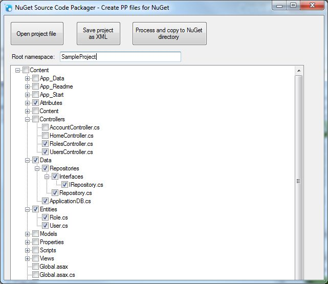

# NuGetPackager

Imported from CodePlex: https://nugetpackager.codeplex.com/

*Project Description*
The NuGet Source Code Packager allows you to select the source code files you want to copy to the content directory for your NuGet package.

The files are copied and renamed to the .pp extension for NuGet pre-processing. The root namespace is also replaced with $rootnamespace$

- Select your VS Project
- Select the source code files you want to include in your NuGet package
- Save your selection to be able to use it later
- Let the NuGet Source Code Packager process your sourcode files
- Click Once application, not installation needed and automatic updates.

